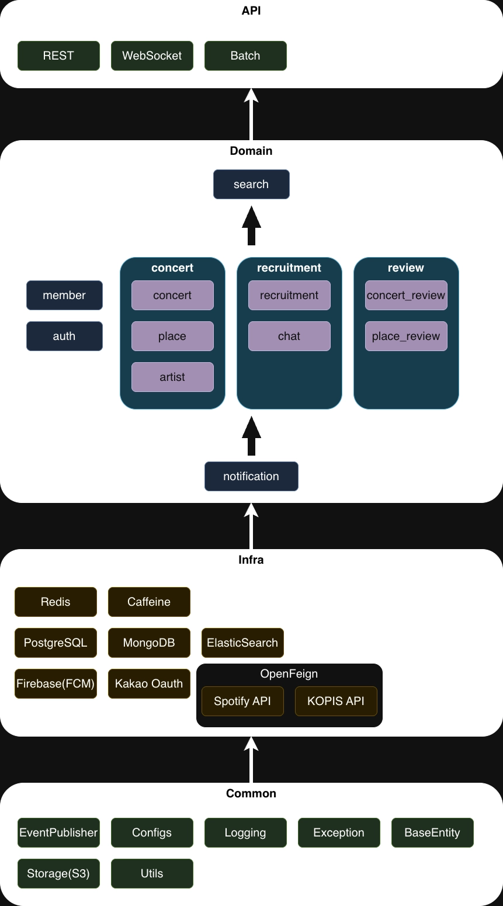

# 모듈 구조

Allreva는 공연 정보 조회, 차량 대절 모집, 신청, 알림처럼 서로 다른 변경 이유를 가진 기능들이 함께 있는 서비스입니다. 처음에는 기능이 하나의 코드 흐름 안에 섞이기 쉬웠고, 특정 기능을 수정할 때 다른 도메인까지 함께 확인해야 했습니다.

그래서 도메인을 기준으로 책임을 나누고, 각 영역이 맡는 역할을 명확하게 정리했습니다.

## 주요 도메인

1. **Auth(인증/인가)**: OAuth2 로그인, 토큰 발급/갱신, 권한 검증
2. **Member(회원)**: 계정 관리, 프로필, 마이페이지
3. **Concert(공연)**: 공연 상세 정보, 외부 API 연동 데이터 관리
4. **Place(공연장)**: 위치 정보, 시설 안내, 좌석 레이아웃
5. **Recruitment(모집)**: 차 대절 수요 조사(Survey), 차량 대절(Rent), 덕질 메이트 구인
6. **Notification(알림)**: 상태 변경 알림, 일정 리마인더, 실시간 푸시

## 분리 기준

모듈을 나눌 때 기준은 기술 계층이 아니라 **변경 이유**였습니다.

- 공연 데이터 변경은 `Concert`, `Place` 쪽 변경으로 제한
- 차량 대절 모집/신청 규칙 변경은 `Recruitment` 쪽 변경으로 제한
- 인증 정책 변경은 `Auth` 쪽 변경으로 제한
- 알림 전송 방식 변경은 `Notification` 쪽 변경으로 제한

이렇게 나누면 기능을 수정할 때 확인해야 하는 범위가 줄어들고, 각 도메인의 규칙을 더 쉽게 찾을 수 있습니다.

## 기대한 효과

### 1. 변경 영향 범위 축소

차량 대절 신청 규칙을 수정할 때 공연 조회나 회원 관리 코드까지 같이 건드리지 않도록 책임을 분리했습니다. 특히 `Recruitment`는 동시 신청, 정원 검증, 신청 내역 조회처럼 데이터 정합성과 성능 이슈가 자주 발생하는 영역이라 독립적인 변경 단위로 관리하는 것이 중요했습니다.

### 2. 유스케이스 중심 이해

단순히 Controller, Service, Repository 계층만 보는 것이 아니라 “사용자가 차량 대절을 신청한다”, “참여 내역을 조회한다” 같은 유스케이스 단위로 코드를 따라갈 수 있도록 구성했습니다. 덕분에 문제 해결 문서와 코드 흐름을 함께 연결하기 쉬워졌습니다.

### 3. 테스트와 문서화 기준 확보

도메인 경계가 정리되면 테스트 범위도 정하기 쉬워집니다. 예를 들어 동시 신청 정합성은 `Recruitment`의 핵심 규칙으로 보고 별도 부하 테스트와 문제 해결 문서로 관리했습니다.

## 주의한 점

모듈 분리는 목적이 아니라 수단이라고 판단했습니다. 규모가 크지 않은 프로젝트에서 무리하게 모듈을 나누면 오히려 복잡도만 늘 수 있기 때문입니다. 그래서 모든 기능을 세밀하게 쪼개기보다, 변경 이유가 분명하고 설명 가능한 도메인 단위부터 분리했습니다.

현재 구조의 목표는 “복잡한 구조를 만드는 것”이 아니라, 기능 변경 시 영향 범위를 줄이고 팀원이 코드와 문서를 함께 보며 흐름을 빠르게 이해할 수 있게 하는 것입니다.
