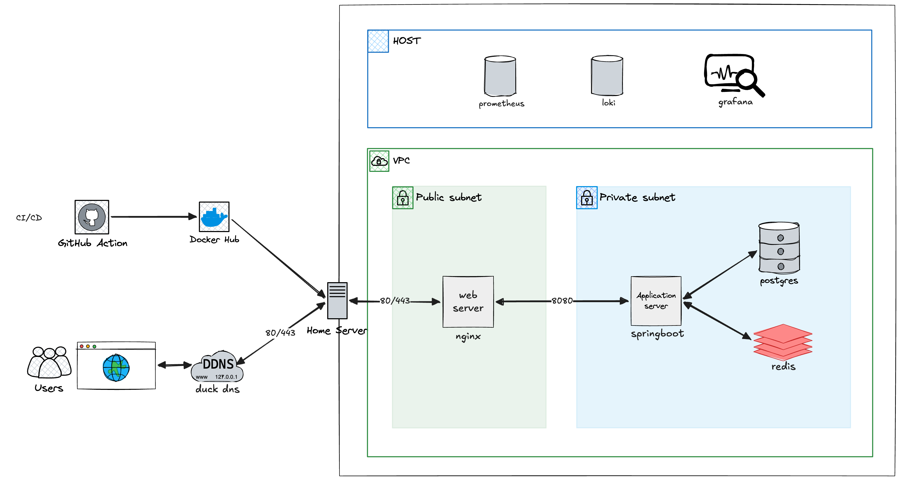

# Tech Stack
- SpringBoot 3.3 & Java 17
- PostgreSQL
- Redis
- Ngnix
- AWS S3
- Github Action
- Docker + KVM
# Infra Structure

## Spec
VM 4개로 구성
Host에서는 Docker로 간단한 모니터링 시스템 구축

| VM         | service          | cpu     | ram | disk | 내부 bridge ip   |
| ---------- | ---------------- | ------- | --- | ---- | -------------- |
| web-tier   | Nginx            | vCPU: 1 | 1GB | 10GB | 192.168.100.10 |
| was-tier   | Spring Boot(JVM) | vCPU: 2 | 4GB | 20GB | 192.168.100.20 |
| db-tier    | PostgreSQL       | vCPU: 2 | 4GB | 50GB | 192.168.100.30 |
| cache-tier | Redis            | vCPU: 1 | 2GB | 20GB | 192.168.100.40 |
### Host 머신 스펙
- 모델: HP Elitebook 845 G7 (AMD Ryzen Pro 4000 시리즈)
- RAM: 16GB → Host 예약 2GB / VM 11GB / 여유 3GB
- Storage: 512GB SSD → Host OS 40GB / VM 170GB / 여유 ~300GB
- CPU: 8코어 / 16스레드 (KVM)
- OS: Debian 13 (Host) / Debian 12 minimal (각 VM)
### 네트워크 구성
- KVM 내부 브리지: virbr1 (192.168.100.0/24) — VM 간 통신 전용
- 트래픽 흐름: 외부 → Web(Nginx) → WAS(Spring Boot) → DB / Cache
- Monitoring: Host에서 Docker로 Prometheus + Grafana + Loki 구성