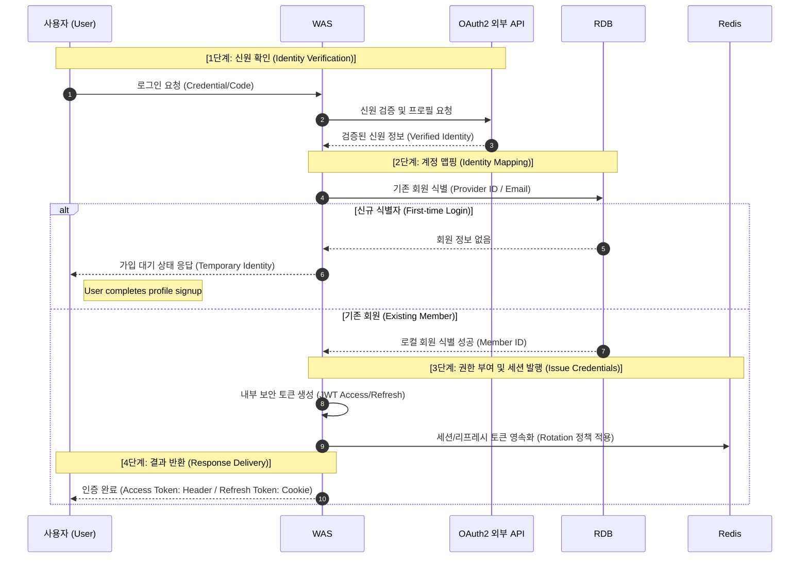
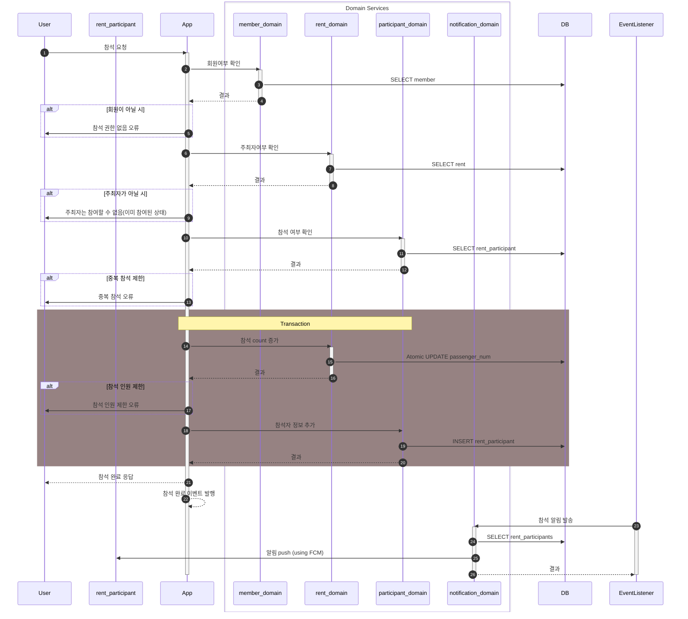
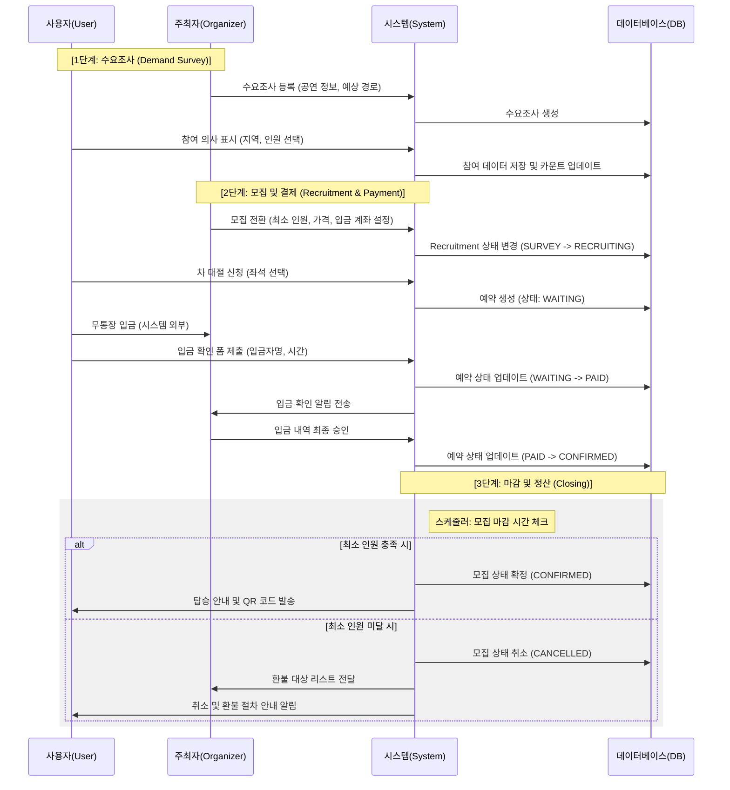
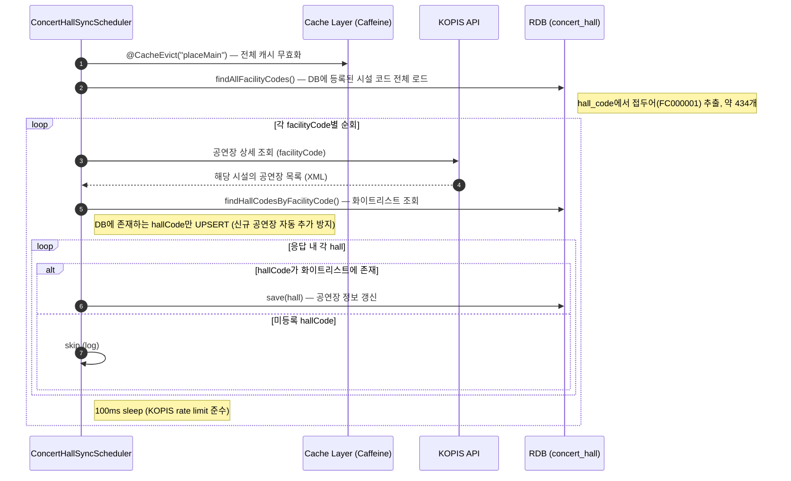
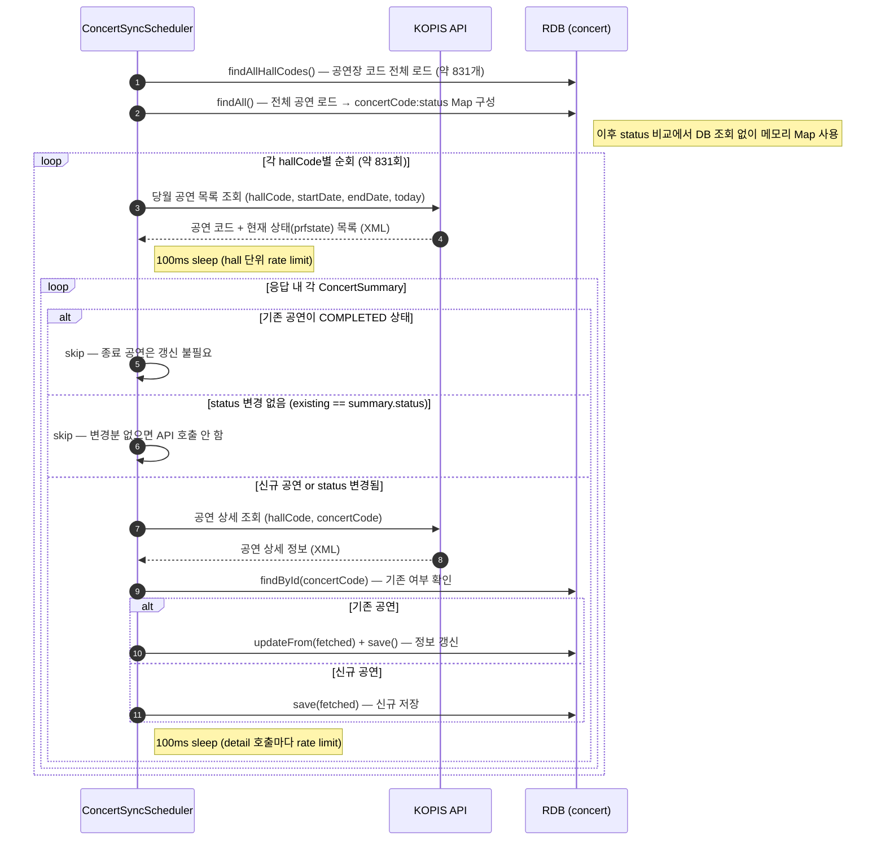
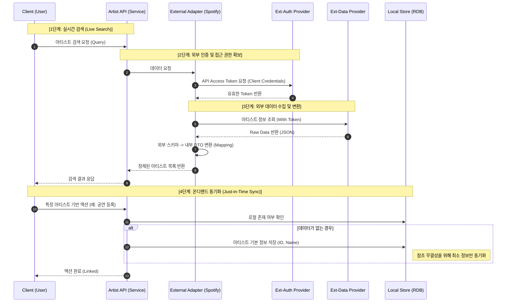

# OAuth2 로그인 프로세스

- 모듈 분리: auth 모듈은 member 모듈의 서비스가 아닌 Repository에만 의존하거나, 혹은 MemberService의 특정 '조회' 기능에만 의존하도록 결합도를 낮추세요.
- DTO 일관성: UserInfoResponse처럼 모든 정보를 한 번에 주는 구조도 좋지만, "인증 도메인"과 "회원 도메인"의 정보를 분리하여 필요한 것만 내려주는 AuthContext 객체를 내부에 도입하는 것을 추천합니다.

# 수요 조사 및 차량 대절 프로세스

# 공연 및 공연장 데이터 배치 업데이트 프로세스

고려할 점

- Bulk Insert 고려: 데이터 양이 방대할 경우 건당 save보다는 saveAll을 통해 배치를 묶어서 DB에 던지는 방식(Bulk Insert)으로 성능을 더 높일 수 있습니다.
- Circuit Breaker: KOPIS partial failure(타임아웃 반복) 시 스케줄러 스레드가 수 시간 점유되는 상황을 조기 차단하는 용도. 단, 스케줄러는 전용 스레드 풀을 사용하므로 사용자 API 스레드로의 직접 전파 위험은 낮음. 또한 현재 구조는 메서드 단위 @Transactional 없이 repository 메서드별 개별 트랜잭션으로 동작하므로, KOPIS 타임아웃 대기 중 DB 커넥션을 점유하지 않아 커넥션 풀 고갈 위험도 낮음.
- 장애 복구 전략 (Rollback vs Checkpoint): hall 간 의존성이 없는 독립 작업이므로 롤백보다 재시작 지점 기록(Checkpoint)이 적합한 구조. Spring Batch의 JobExecutionContext가 이를 지원하나, 일 1회 전체 재순회로 자연스럽게 재처리되는 구조이므로 단순 스케줄러로 충분하다고 판단. (실패한 hall은 다음날 새벽 4시에 자동 재처리됨)
- Spring Batch 미도입 근거: Checkpoint/Restart, 대용량 Chunk 처리, Job 실행 이력 관리 세 가지 중 해당 없음. 프로젝트 내 Spring Batch를 사용하는 곳이 있더라도 도구는 문제에 맞게 선택해야 하며, 억지로 도입하면 코드 복잡도만 증가 (Job/Step/Reader/Processor/Writer + JobRepository 메타 테이블).

## 공연장 동기화 (매월 1일 새벽 2시)

## 공연 정보 동기화 (매일 새벽 4시)

실측 기준 (2026-05-04 로컬 실행):
- 공연장 동기화: 약 142초 (facilityCode 434개 × HTTP + 100ms sleep)
- 공연 정보 동기화: 약 310초 (hallCode 831개 × summary HTTP + 100ms sleep, 상세 API 92회 추가 호출)

# 아티스트 데이터 조회 프로세스

- Token Caching: 외부 API Access Token은 만료 전까지 유효하므로, 매번 발급받지 않고 Redis에 캐싱하여 성능을 높이는 설계를 언급하면 좋습니다.
- Rate Limiting 처리: 외부 API는 호출 횟수 제한이 있는 경우가 많습니다. 이를 대비해 Resilience4j 같은 라이브러리로 Rate Limiter를 적용하는 고민을 했다고 하면 더욱 전문적으로 보입니다.
- Lazy Loading vs Eager Loading: 아티스트의 상세 이미지나 앨범 정보는 검색 시점이 아닌, 상세 조회 시점에 가져오도록 설계하여 응답 속도를 관리합니다.